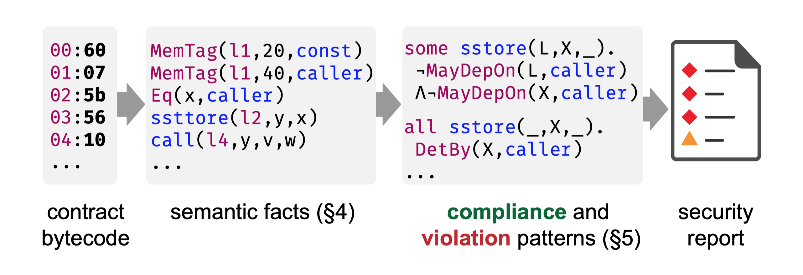
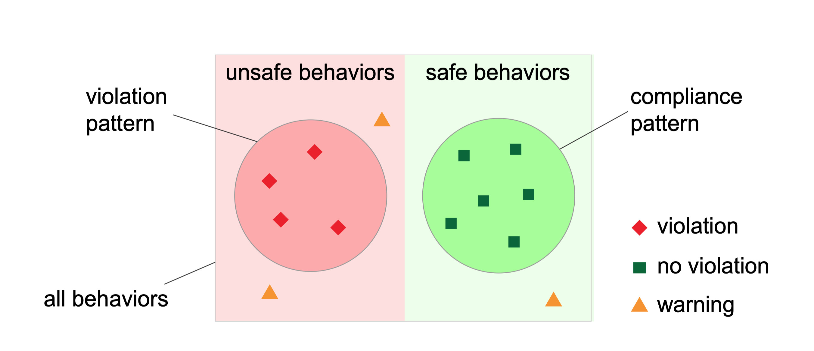

# Securify: 智能合约安全分析实践

**Author**：Peter Tsankov, Andrei Dan, Dana Drachsler-Cohen, Arthur Gervais, Florian Bunzli, Martin Vechev

## 摘要

公链允许任意程序在没有可信第三方依赖的情况下执行，让相互不信任的实体进行交互，这个程序就是智能合约。尽管智能合约存在很大潜力，但频发的安全问题撼动了人们心中对智能合约处理数十亿美元的信任。

为了解决这个问题，我们研发了 Securify，一个可拓展、全自动、能够合理证明合约行为安全性的以太坊智能合约安全分析器。Securify的分析包括两个步骤，首先，通过符号分析的方法分析合约依赖图，从代码中提取语义信息，然后，使用检查捕获足够多的条件来证明一个属性是否存在的符合和不符合的模式。为了拓展性，所有的模式都由特定领域语言来定义。

Securify 是公开发布的，它已经分了超过1.8万份用户提交的合约代码，并由专家定期审计。我们对 Securify 在现实的以太坊智能合约进行了大规模的评估，证明它可以有效地检测智能合约安全性，发现智能合约可能才存在的安全问题。

**关键字**：智能合约、安全分析、分层数据记录

## 1.介绍

区块链平台，比如中本聪提出的比特币，允许加密货币在相互不信任的各方之间进行交易。为了排除对信任的需求，中本聪设计了一个点对点的网络，能够让节点之间达成一致的交易记录。V神确定了除了交易在分布式计算之外的适用性，并且设计了支持执行图灵完备语言程序（即智能合约）的以太坊区块链。智能合约已被证明适用于许多领域，包括金融业、公共部门和跨领域行业。

智能合约的广泛使用需要高度的安全保障。不幸的是，写出没有安全问题的智能合约仍然是一个挑战。因此，智能合约的安全漏洞每隔几个月就会被发现和利用。因此，这些漏洞在过去的几年中已经导致了数亿美元损失：2016年6月，很受欢迎的 The DAO 合约被黑导致1.5亿美元被盗，广泛使用的 Parity 多重签名钱包被黑导致3000万美元被盗，几个月后，由于一个漏洞导致了2.8亿美元被冻结。很明显，目前急需有效智能合约安全审计。

**关键的挑战**。研发一个高效的智能合约安全分析器的最主要挑战是编程语言的图灵完备性，这让我们无法对任意属性进行校验。为了解决这个问题，当前的自动化解决方案往往依赖于相当通用的测试和符号执行方法（例如，[Oyente](https://github.com/melonproject/oyente) 和 [Mythril](https://github.com/ConsenSys/mythril-classic) ）。虽然在某些方面中很有用，但这些方法有几个缺点：
- （i）他们可能会漏掉严重违规行为（由于近似不足）
- （ii）然而，也可能产生误报（由于对特定领域元素的建模不精确）
- （iii）它们未能在现实合同上实现足够的代码覆盖率（Oyente 在流行的 [Parity](https://www.parity.io/) 钱包上仅实现20.2% 的覆盖率）。

总的来说，这些缺点给他们的用户带来了很大的负担，他们必须检查所有报告中的错误警报，还要担心未报告的漏洞。事实上，许多智能合约的安全属性本身就很难直接解释。解决这些挑战的可行途径是建立一个针对重要领域特定属性的自动验证器。例如，最近的工作只专注于识别智能合约中的重入漏洞。

**对特定领域的见解**。对这项工作的一个关键观察是，通常可以设计出表示在合约数据流图上的精确模式，这种模式的匹配意味着只有违反或满足原始安全属性。例如，在以太坊智能合约中，通过匹配一个 `没有在写入存储之后调用的状态` 模式可以证明 90.9% 的调用没有臭名昭著的 DAO bug。之所以有可能建立这样一种联系，是因为在现实世界中，违反原始属性的合约往往违反更简单的属性（由模式捕获）。实际上，在验证方面，使用模式而不是对应属性的关键优势在于模式更适合自动推理。

**Securify**：特定领域的验证器。基于上述见解，我们开发了 Securify，这是一款轻量级，可扩展的以太坊智能合约安全验证器。关键的技术思想是定义两种相反的给定安全属性的模式：（i）合规模式，这意味着满足正确的规则，以及（ii）违规模式，这意味着它不满足正确的规则。为了检查这些模式，Securify 在分层 Datalog 中用符号编码合约的依赖图，并利用现成的可扩展 Datalog 计算器有效地（通常在几秒钟内）分析代码。 为了确保可扩展性，所有模式都以特定领域语言（DSL）表示。

**图1：Securify 的方法是基于对语义程序的每一项的自动推断，然后检查这些项目是合规模式还是违规模式**

**图2：Securify 使用合规模式和违规模式来确定哪些行为是安全的，哪些是不安全的。其余的都被标记为警告（避免漏掉一些错误）**

在 [图1](#figure1) 中，我们说明了 Securify 的分析流程。从合约的字节码（或可编译为字节码的源代码）开始，Securify 通过分析合同的依赖图来推导出语义项目，并使用这些项目来检查是合规模式还是违规模式。 根据这些检查的结果，Securify 将所有合合约行为分为违规行为（♦），警告行为（▲）和合规行为（■），如 [图2](#figure2) 所示。这里，大框包含了所有合约行为，划分为安全（满足正确规则）和不安全（违反正确规则）两部分。 Securify 将与违规模式匹配的所有行为标记为违规行为（♦），将剩下的与合规模式不匹配的所有行为标记为警告行为（▲）。
